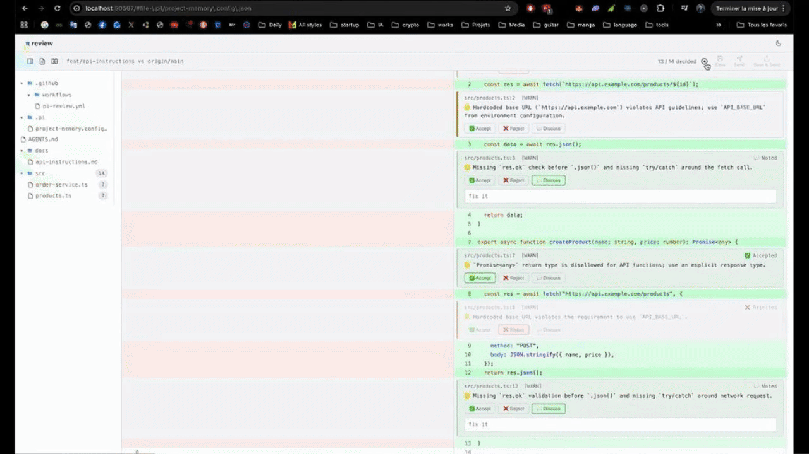

# pi-reviewer

AI-powered PR reviewer using the pi agent — model-agnostic, works with any provider.

- Review diffs locally, over SSH on a remote machine, or automatically on every pull request in CI
- Findings structured by severity (critical / warn / info) and filtered against your project conventions
- Interactive browser UI — inspect each finding against the diff, decide per-comment, then save or send to the agent



---

## Extension

Runs inside the [pi](https://github.com/mariozechner/pi) TUI as a `/review` command. The agent reviews your diff and returns structured findings — you decide what to do with them.

### Local mode

The default. Fetches the diff and your project conventions locally, spawns a pi subprocess to run the review, then saves the result to `pi-review.md`.

```
/review
/review --branch dev
/review --pr 42
/review --diff HEAD~1
```

### SSH mode (`--ssh`)

For reviewing code on a remote machine. Instead of spawning a subprocess, SSH mode runs directly inside the current pi agent session — which already has SSH bash tool access to the remote. No local git access needed. Requires an SSH extension (e.g. [ssh.ts](https://github.com/badlogic/pi-mono/blob/main/packages/coding-agent/examples/extensions/ssh.ts)) to be active.

```
/review --ssh
/review --ssh --pr 42
/review --ssh --branch dev
```

Before starting the agent, pi-reviewer fetches everything over SSH in parallel: the diff, `AGENTS.md` / `CLAUDE.md`, `REVIEW.md`, and any context provider files. The diff is passed directly to the agent — no extra round-trip needed. The agent saves `pi-review.md` directly on the remote.

> **Note:** `--model` and `--thinking` have no effect in SSH mode — the model is fixed to whatever the parent session is using.

### UI mode (`--ui`)

Opens a local browser-based review interface after the agent finishes. Inspect each finding against the diff, decide per-comment (accept / reject / discuss), then click **Finish review** to save decisions to `pi-review.md`, send accepted findings to the agent, or both. Works with `--ssh` too.

```
/review --ui
/review --ssh --ui
```

Theme, view mode, default model, and thinking level are remembered across reviews and can be changed from the settings panel inside the UI.

---

## CI Agent

Runs on every pull request via GitHub Actions and posts an inline review comment on the PR. See [CI.md](./CI.md) for setup, inputs, and custom bot identity.

---

## Options and configuration

### Extension options

Install the extension once:

```bash
pi install https://github.com/zeflq/pi-reviewer
```

Then inside the pi TUI:

| Option | Description | Example |
|---|---|---|
| `--branch <name>` | Compare against this branch (default: auto-detected from `origin/HEAD`) | `--branch origin/dev` |
| `--pr <number>` | Fetch and review a specific PR diff via `gh` CLI | `--pr 42` |
| `--diff <ref>` | Review changes since a specific git ref | `--diff HEAD~1` |
| `--ssh` | SSH mode: agent fetches diff and conventions on the remote | `--ssh` |
| `--ui` | Open browser review UI after the agent finishes | `--ui` |
| `--min-severity <level>` | Only report issues at this level and above: `info`, `warn`, or `critical` | `--min-severity warn` |
| `--model <id>` | Model for this review in `provider/id` format. **Local mode only.** | `--model openai/gpt-4o` |
| `--thinking <level>` | Thinking budget: `off`, `minimal`, `low`, `medium`, `high`, `xhigh`. **Local mode only.** | `--thinking low` |
| `--dir <path>` | Run the review in a subdirectory (e.g. a package in a monorepo). Context files are loaded from the sub-project and all ancestor directories up to the repo root. | `--dir packages/api` |
| `--verbose` | Print full agent output to the console | |
| `--dry-run` | Print the diff and prompt without calling the agent | |

`--model` and `--thinking` apply to the current run only. To change the permanent default, use the settings panel in `--ui` or edit `~/.pi/pi-reviewer/config.json` directly.

### Configuration

Persistent settings are stored in `~/.pi/pi-reviewer/config.json`. All fields are optional:

```json
{
  "theme": "dark",
  "viewMode": "split",
  "model": "anthropic/claude-sonnet-4-6",
  "thinking": "low",
  "minSeverity": "INFO",
  "branch": "origin/develop",
  "autoCollapseViewed": false,
  "verbose": false
}
```

| Field | Values | Default | How to set |
|---|---|---|---|
| `theme` | `"dark"` \| `"light"` | `"dark"` | Settings panel in `--ui` |
| `viewMode` | `"split"` \| `"unified"` | `"split"` | Settings panel in `--ui` |
| `model` | `"provider/id"` string | _(parent session's model)_ | Settings panel or edit directly |
| `thinking` | `"off"` \| `"minimal"` \| `"low"` \| `"medium"` \| `"high"` \| `"xhigh"` | _(parent session's level)_ | Settings panel or edit directly |
| `minSeverity` | `"INFO"` \| `"WARN"` \| `"CRITICAL"` | `"INFO"` | Edit directly |
| `branch` | any branch name | _(auto-detected from `origin/HEAD`)_ | Edit directly |
| `autoCollapseViewed` | `true` \| `false` | `false` | Settings panel in `--ui` |
| `verbose` | `true` \| `false` | `false` | Edit directly |

**`minSeverity`** — `"INFO"` reports everything; `"WARN"` skips informational notes; `"CRITICAL"` only surfaces blockers. The `--min-severity` flag uses lowercase, the config file uses uppercase.

**`branch`** — use the `origin/<name>` form (e.g. `"origin/develop"`) rather than a bare branch name. This ensures `git merge-base` diffs against the last pushed state, avoiding an empty diff when you're already on that branch.

### Diff coverage

`/review` and `--branch` use `git merge-base` to diff from where your branch diverged — committed changes, staged files, and unstaged edits are all included. You don't need to commit before reviewing.

`--diff` and `--pr` use the exact ref or remote diff as-is.

### Diff size handling

pi-reviewer automatically filters out noise files (lockfiles, `dist/`, `build/`, `.next/`, `node_modules/`, minified files, `.d.ts` files). If the remaining diff still exceeds 100k characters, whole file sections are dropped — never mid-hunk — and the agent is told which files were skipped.

```
⚠ 1 noise file excluded (package-lock.json) — 2 files skipped — diff exceeded 100,000 chars (src/big.ts, src/huge.ts)
```

### Project conventions

Create `AGENTS.md` or `CLAUDE.md` at your project root to give the reviewer context about your conventions. `REVIEW.md` is always loaded alongside it for review-specific rules.

- `AGENTS.md` is checked first; `CLAUDE.md` is the fallback. Matched case-insensitively.
- Files can also live in `.pi/`, `.claude/`, or `.agents/` subdirectories.
- **Monorepo support:** pi-reviewer walks up from the working directory to the git root and collects `AGENTS.md`/`REVIEW.md` at every level, root first. `--dir` extends the walk-up to the outer project root.

**`AGENTS.md`** — general project conventions:
```markdown
# Project Conventions

## Function Naming
- Prefix async data fetchers with `fetch` (e.g. `fetchUser`, `fetchOrders`)
- Prefix boolean functions with `is`, `has`, or `can`
- Prefix mutations with a verb: `update`, `delete`, `create`, `reset`
```

**`REVIEW.md`** — review-only rules:
```markdown
# Review Guidelines

## Always flag
- New API endpoints without an integration test
- Database migrations that are not backward-compatible
- `fetch` calls missing `res.ok` check or `try/catch`

## Skip
- Formatting-only changes in generated files under `dist/`
- Lock file diffs
```

### Context providers

Any pi extension can inject additional context into the review prompt by listening on the `"pi-reviewer:collect-context-providers"` event — providers receive the changed files and a filesystem abstraction (works locally and over SSH) and return `{ path, content }` pairs appended to the system prompt.

**[pi-reviewer-doc-context](./extensions/pi-reviewer-doc-context/README.md)** is the built-in provider. It scans your project's doc dirs for `.md` files with a `description` frontmatter field and loads the ones relevant to the current diff. See its README for the doc format, configuration, and the full provider API.

---

See [TODO.md](./TODO.md) for the full roadmap.
