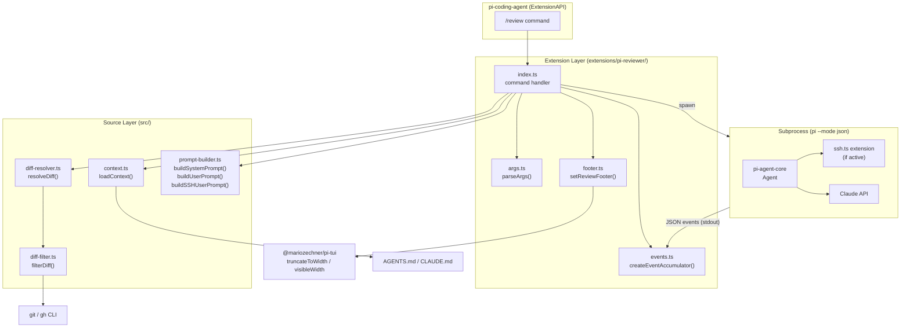
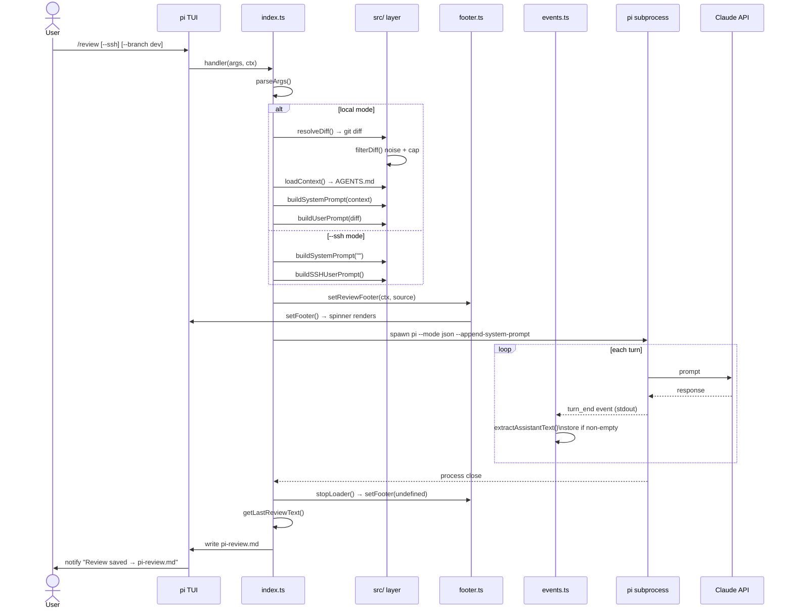

# Architecture

## Layers

```mermaid
flowchart TD
    subgraph pi["pi-coding-agent (ExtensionAPI)"]
        cmd["/review command"]
    end

    subgraph ext["Extension Layer (extensions/pi-reviewer/)"]
        args["args.ts\nparseArgs()"]
        events["events.ts\ncreateEventAccumulator()"]
        footer["footer.ts\nsetReviewFooter()"]
        index["index.ts\ncommand handler"]
    end

    subgraph src["Source Layer (src/)"]
        resolver["diff-resolver.ts\nresolveDiff()"]
        filter["diff-filter.ts\nfilterDiff()"]
        context["context.ts\nloadContext()"]
        prompt["prompt-builder.ts\nbuildSystemPrompt()\nbuildUserPrompt()\nbuildSSHUserPrompt()"]
    end

    subgraph subprocess["Subprocess (pi --mode json)"]
        agent["pi-agent-core\nAgent"]
        ssh["ssh.ts extension\n(if active)"]
        claude["Claude API"]
    end

    tui["@mariozechner/pi-tui\ntruncateToWidth / visibleWidth"]
    git["git / gh CLI"]
    fs["AGENTS.md / CLAUDE.md"]

    cmd --> index
    index --> args
    index --> footer --> tui
    index --> events
    index --> resolver --> filter --> git
    index --> context --> fs
    index --> prompt
    index -->|"spawn"| subprocess
    agent --> ssh
    agent --> claude
    subprocess -->|"JSON events (stdout)"| events
```

## Runtime flow

```mermaid
sequenceDiagram
    actor User
    participant pi as pi TUI
    participant ext as index.ts
    participant src as src/ layer
    participant footer as footer.ts
    participant events as events.ts
    participant sub as pi subprocess
    participant claude as Claude API

    User->>pi: /review [--ssh] [--branch dev]
    pi->>ext: handler(args, ctx)
    ext->>ext: parseArgs()

    alt local mode
        ext->>src: resolveDiff() → git diff
        src->>src: filterDiff() noise + cap
        ext->>src: loadContext() → AGENTS.md
        ext->>src: buildSystemPrompt(context)
        ext->>src: buildUserPrompt(diff)
    else --ssh mode
        ext->>src: buildSystemPrompt("")
        ext->>src: buildSSHUserPrompt()
    end

    ext->>footer: setReviewFooter(ctx, source)
    footer->>pi: setFooter() → spinner renders

    ext->>sub: spawn pi --mode json --append-system-prompt
    loop each turn
        sub->>claude: prompt
        claude-->>sub: response
        sub-->>events: turn_end event (stdout)
        events->>events: extractAssistantText()\nstore if non-empty
    end

    sub-->>ext: process close
    ext->>footer: stopLoader() → setFooter(undefined)
    ext->>ext: getLastReviewText()
    ext->>pi: write pi-review.md
    pi->>User: notify "Review saved → pi-review.md"
```
